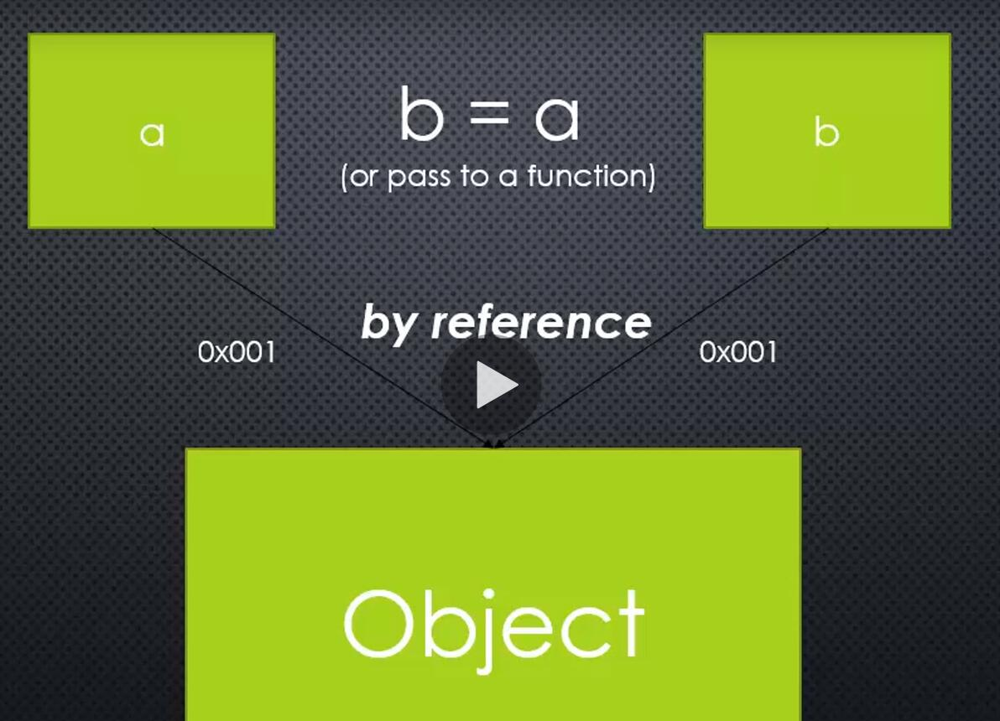

## how modules and require work in Node.js
### what (是什么)
module.exports = greet;

it make greet available for use outside the module! 他让module部分可以在别的module中可以访问得到！

* module: app.js
```javascript
  let greet = require('./greet.js');
  greet();
```

* module: greet.js
```javascript
  function greet() {
    console.log('你好');
  }
  module.exports = greet;
```
## Object and Object Literals（对象和对象字面量）
### num*1* 键值对 
name/value pairs【a name which maps to a value】name映射value
the name may be defined more than once, but only can have one value in any given context.That value may be more name/value pairs [*name*可被定义多次，但是在给定上下文中仅仅匹配一个值。同时value值也可以是更多的键值对]
### num*2* Object
**Object contain**: *1*. primitive property *2*. object property *3*. Function method 
object拥有属性值的指针。0x002、0x003、0x004
## prototypal inheritance and function constructors【原型继承和构造函数】
### Inheritance:
one object gets access to the properties and methods of anther object.
## Function constructor
function constructor: a normal function  that is used to construct Object . this points a new empty object.and that object is returned from the function automatically.[构造函数为普通函数用于构造一个对象。this指向新的对象，对象由function生成]
* 获取对象原型
```javascript
  function Person(last, first) {
    this.lastName = last;
    this.firstName = first;
  }
  Person.prototype.greet = function() {
    console.log('hi' + this.lastName + this.firstName)
  }
  let jane = new Person('jane', 'smith');
  console.log(jane.__proto__, '获取对象原型');
```
## by reference by value
### by value 

### by reference 
